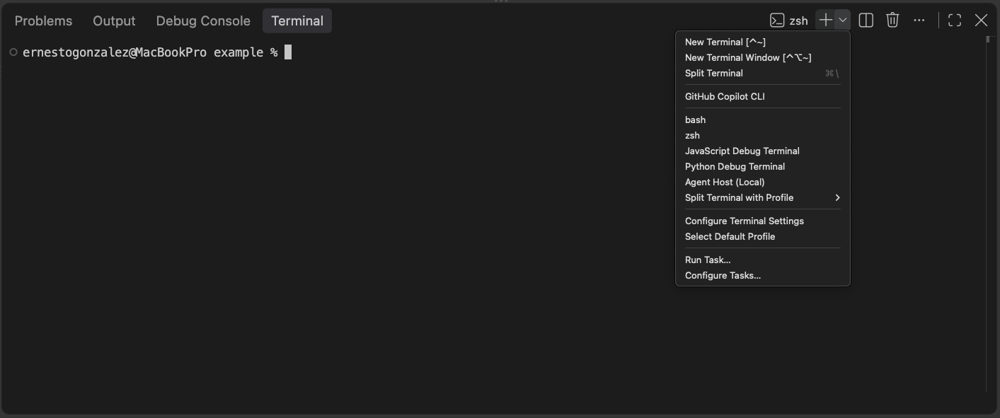
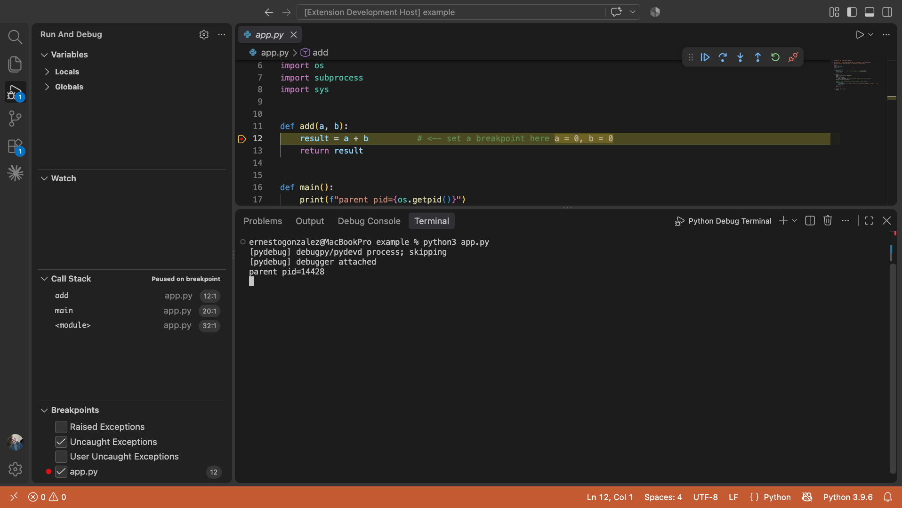

# Python Debug Terminal

A **Python Debug Terminal** for VS Code: open one, and every Python process you
launch from it attaches to the debugger automatically — including child
processes it spawns. The intention with this extension was to build a Python analogue 
of the built-in [JavaScript Debug Terminal](https://github.com/microsoft/vscode-js-debug).

VS Code can already [debug a Python file](https://code.visualstudio.com/docs/python/debugging)
— via the **Run and Debug** view or the **Python Debugger: Debug Python File**
command. This extension is an alternative, terminal-first way to get there:
rather than starting a debug session per file, you run Python however you like
from the terminal, and each process — plus any child it spawns — attaches on its
own.

```
┌──────────────────────┐        announces {pid, port, token}        ┌────────────────────┐
│  Python Debug Term.   │  ── sitecustomize phones home over TCP ──▶ │  Extension (rendez- │
│  (PYTHONPATH injected) │                                            │  vous TCP server)   │
│                        │                                            │                     │
│  $ python app.py       │  ◀── VS Code attaches (debugpy connect) ── │  startDebugging()   │
└──────────────────────┘                                            └────────────────────┘
```

## Usage

Open a **Python Debug Terminal** and use Python from it exactly as you normally
would — every process you launch attaches to the debugger on its own, and so do
any child processes it spawns.

**1. Open a Python Debug Terminal.** Open the Command Palette (<kbd>⇧⌘P</kbd>)
and run **Create Python Debug Terminal**, or click the `⌄` dropdown next to the
`+` in the terminal panel and pick **Python Debug Terminal** from the profile
list.



**2. Set a breakpoint and run your script.** Set breakpoints the usual way — by
clicking the editor gutter — then run your program from that terminal, e.g.
`python app.py`. The process attaches automatically and stops at your
breakpoints; the debug toolbar, call stack, and variables light up just as they
would for a normal launch.



**3. Child processes come free.** Anything your script spawns — e.g.
`subprocess.run([sys.executable, ...])` — inherits the terminal's environment and
attaches as its own debug session, with no extra configuration. Try it with
[`example/app.py`](example/app.py), which launches a child interpreter.

The terminal behaves like any other integrated terminal; the only difference is
the injected environment that makes each Python process phone home and attach.
See [How it works](#how-it-works) for the mechanism, and [Settings](#settings)
to tune wait-for-attach behavior, the skip-list, forked-child handling, and more.

## How it works

1. **Injection.** When the terminal opens, the extension prepends
   [`pydebug/`](pydebug/) to `PYTHONPATH` and sets `PYDEBUG_IPC` (the rendezvous
   address) and `PYDEBUG_TOKEN` (a per-session secret). See
   [`src/terminal.ts`](src/terminal.ts).
2. **Bootstrap.** [`pydebug/sitecustomize.py`](pydebug/sitecustomize.py) is
   imported by CPython's `site` machinery at startup. It filters out tooling
   noise, opens a `debugpy` listener on an ephemeral port, and announces
   `{pid, port, token, …}` to the rendezvous server.
3. **Attach.** The extension validates the token and calls
   `vscode.debug.startDebugging` with an ordinary debugpy *attach-by-connect*
   config pointed at the announced port. See [`src/extension.ts`](src/extension.ts).
4. **Children come free.** Environment variables inherit, so
   `subprocess.Popen([sys.executable, "worker.py"])` re-runs `sitecustomize` and
   the worker attaches as its own session.

### Why `sitecustomize`, not a `.pth` file

The obvious design — ship a `.pth` file whose `import` line runs the bootstrap —
**does not work via `PYTHONPATH`.** CPython only executes `.pth` files found in
*site* directories (site-packages), not arbitrary `PYTHONPATH` entries. A
`sitecustomize` module, by contrast, is imported automatically as long as it is
importable, which `PYTHONPATH` guarantees. This was verified empirically before
choosing the mechanism.

Because we may shadow a user's own `sitecustomize`, our bootstrap removes its own
directory from `sys.path` and then chains to any real `sitecustomize` it hid.

### Why attach-by-connect, not a custom adapter

The debuggee could instead `debugpy.connect()` back to an extension-owned socket
that we adopt as the debug adapter transport (via a
`DebugAdapterDescriptorFactory`). That is the more faithful mirror of the JS
bootloader, but the socket-adoption factory is the one genuinely fragile piece.
This scaffold takes the robust path: the debuggee **listens**, announces its
port, and the extension attaches with a stock config. No custom adapter plumbing.

## Known blind spots (by design)

- `python -S`, `-E`, `-I` skip site processing / ignore `PYTHONPATH` → no attach.
- `os.fork()` / `multiprocessing` (default `fork` on Linux) children never re-run
  interpreter startup, so `sitecustomize` never fires. Enable
  `pythonDebugTerminal.handleForkedChildren` to let debugpy patch `fork`/`spawn`
  instead.
- Anything that scrubs its environment before spawning breaks the inheritance
  chain (same as `NODE_OPTIONS` in Node).
- A shell rc file that unconditionally `export PYTHONPATH=...` can clobber our
  prepend.
- The debuggee needs `debugpy` importable. If it isn't, the extension points
  `PYDEBUG_DEBUGPY_PATH` at the copy bundled with `ms-python.debugpy` as a
  best-effort fallback.

## Settings

| Setting | Default | Meaning |
| --- | --- | --- |
| `pythonDebugTerminal.waitForClient` | `true` | Pause each process at startup until the debugger attaches and sends breakpoints (required for breakpoints to reliably bind). |
| `pythonDebugTerminal.waitTimeout` | `10` | Max seconds to wait when the above is on. |
| `pythonDebugTerminal.skipPrograms` | pip, black, ruff, mypy, … | Program names never attached to. |
| `pythonDebugTerminal.justMyCode` | `true` | Passed through to debugpy. |
| `pythonDebugTerminal.handleForkedChildren` | `false` | Debug `fork`/`multiprocessing` children via debugpy's patching. |
| `pythonDebugTerminal.debugLogging` | `false` | Verbose bootstrap diagnostics on stderr. |

## Develop

```bash
npm install
npm run compile      # or: npm run watch
```

Then press <kbd>F5</kbd> ("Run Extension"). In the Extension Development Host,
open the terminal dropdown → **Python Debug Terminal** (or run the
**Create Python Debug Terminal** command), then `python your_script.py`.

Requires the `ms-python.debugpy` extension (declared as an extension dependency),
which provides the `debugpy` debug type used to attach.

## Tests

```bash
npm test              # fast suite: types + unit (TS) + python
npm run test:types    # tsc --noEmit
npm run test:unit     # mocha specs: src/**/*.test.ts (run under tsx)
npm run test:py       # python3 -m unittest discover -s pydebug -p 'test_*.py'
npm run test:integration  # launches a real VS Code instance (see below)
```

### Unit tests (fast, no VS Code)

- [`src/rendezvous.test.ts`](src/rendezvous.test.ts) — the rendezvous wire
  protocol: token accept/reject, malformed/oversized/portless payloads, dispose,
  and logger notifications. `RendezvousServer` takes an injected logger (rather
  than importing the `vscode`-backed one) specifically so it unit-tests in plain
  Node — the same decoupling js-debug relies on.
- [`pydebug/test_sitecustomize.py`](pydebug/test_sitecustomize.py) — the
  attach/skip filtering (debugpy/pydevd self-skip, skip-list by basename and by
  path component, IPC gating) and `sys.path` hygiene. The bootstrap honors
  `PYDEBUG_DISABLE_AUTOINSTALL=1` so it can be imported without attaching.

### Integration tests (real extension host)

Mirroring js-debug's `test:golden`/`runTest.js` layer,
[`src/test/runTest.ts`](src/test/runTest.ts) uses `@vscode/test-electron` to
download a real VS Code, install the `ms-python.debugpy` dependency, open the
[fixtures folder](src/test/fixtures/) as the workspace, and run `*.itest.ts`
specs (found recursively) inside the extension host:

- [`src/test/extension.itest.ts`](src/test/extension.itest.ts) — the extension
  activates and registers its command.
- [`src/test/terminal.itest.ts`](src/test/terminal.itest.ts) — `buildTerminalEnv`
  injects the injector dir on `PYTHONPATH` plus the IPC/token/wait flags.
- [`src/test/breakpoints/`](src/test/breakpoints/) — the end-to-end breakpoint
  suite (see below).

These compile to `out/` via [`tsconfig.integration.json`](tsconfig.integration.json)
(kept separate from the esbuild bundle and the tsx unit run). The run launches a
GUI process, so it needs a display: it works locally and on CI (macOS runners, or
Linux under `xvfb-run`). [`.github/workflows/ci.yml`](.github/workflows/ci.yml)
runs the fast suite plus the integration tests on Ubuntu and macOS.

### Breakpoint E2E (golden snapshots)

[`src/test/breakpoints/`](src/test/breakpoints/) proves the thing we actually
own: that our injection → rendezvous → attach pipeline **delivers the user's
breakpoints to debugpy reliably**, including the first-executable-line case that
motivates [`sitecustomize`'s `wait_for_client`](pydebug/sitecustomize.py). Each
test drives the real user path — set breakpoints through the VS Code UI model,
open a Python Debug Terminal via our command, run a fixture — and observes
debugpy's DAP traffic through a `DebugAdapterTracker`, then snapshots a curated,
normalized log against a committed `.txt` **golden** (js-debug's `assertLog()`
analog). Coverage: set-before-launch, first line, verified-line reporting,
multiple/conditional/hitCondition hits, logpoints, breakpoint removal, and a
child subprocess that attaches as its own session purely via environment
inheritance. See [`PLAN.md`](src/test/breakpoints/PLAN.md) for the full rationale.

```bash
npm run test:integration     # assert against the committed goldens
npm run test:golden:reset    # RESET_GOLDEN=1 — regenerate goldens, then hand-review the diff
```

Goldens are sensitive to the debugpy version (**ms-python.debugpy `2026.6.0`** at
time of writing); on an intentional bump, regenerate with `test:golden:reset` and
eyeball the diff. Aggressive normalization (paths → `${workspaceFolder}`, and a
small allow-list of DAP messages rather than raw dumps) is what keeps that diff
reviewable.

### Coverage

Coverage uses [`nyc`](https://github.com/istanbuljs/nyc) (Istanbul) for the
TypeScript side, as in js-debug, and [`coverage.py`](https://coverage.readthedocs.io/)
for the Python bootstrap:

```bash
npm run coverage      # nyc over the tsx unit run -> text + coverage/ (html, lcov.info)
npm run coverage:py   # coverage.py over the bootstrap tests (needs: pip install coverage)
```

`nyc` maps back to the original `.ts` via tsx's source maps
([`.nycrc.json`](.nycrc.json)); `coverage.py` is configured by
[`.coveragerc`](.coveragerc). Both measure the **unit-tested** code paths, so the
numbers reflect the pure logic (the rendezvous protocol and the bootstrap's
attach/skip filtering) — not the debugpy/GUI paths, which are exercised by the
integration layer instead. CI runs both on every push.

## Status

This is a scaffold: the full injection → rendezvous → attach path is implemented
and the Python/`PYTHONPATH` contracts are verified, but it has not been hardened
for remote/SSH/container path mapping, Windows quoting edge cases, or a published
Marketplace _yet_ release.
